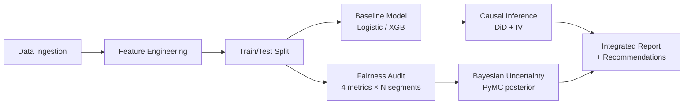

# Consumer Lending Model Audit & Fairness Analysis

> **Offline statistical audit of consumer lending ML models using LendingClub data, identifying disparate impact across income and geographic segments via fairness metrics, causal inference, and Bayesian uncertainty quantification.**

[](https://www.python.org/downloads/)
[](https://cran.r-project.org/)
[](LICENSE)

---

## Table of Contents

- [Overview](#overview)
- [Architecture](#architecture)
- [Project Structure](#project-structure)
- [Key Findings](#key-findings)
- [Quick Start](#quick-start)
- [Pipeline Details](#pipeline-details)
- [Fairness Metrics](#fairness-metrics)
- [Causal Inference](#causal-inference)
- [Bayesian Analysis](#bayesian-analysis)
- [Visualizations](#visualizations)
- [Technologies](#technologies)
- [Contributing](#contributing)
- [License](#license)

---

## Overview

This project conducts a rigorous offline statistical audit of consumer lending ML models to evaluate whether model features genuinely predict default or merely correlate with protected characteristics. The analysis uses publicly available LendingClub loan data and applies a multi-method approach combining:

- **Fairness Metrics**: Demographic parity, equalized odds, predictive parity, and disparate impact ratio across income and geographic segments
- **Causal Inference**: Difference-in-Differences (DiD) and Instrumental Variable (IV) estimation to distinguish causal default predictors from spurious correlates
- **Bayesian Uncertainty Quantification**: Posterior credible intervals on fairness gaps and model coefficients to assess statistical robustness of bias findings

The final deliverable includes clear visualizations and written recommendations for model recalibration to reduce bias while maintaining predictive accuracy.

---

## Architecture

```mermaid
flowchart LR
    classDef data fill:#1d2a3a,stroke:#58a6ff,stroke-width:2px,color:#e6edf3
    classDef analyze fill:#1f2a23,stroke:#3fb950,stroke-width:2px,color:#e6edf3
    classDef out fill:#2a2520,stroke:#c9a227,stroke-width:2px,color:#e6edf3

    D[Data Layer<br/>LendingClub CSV · loader · cleaner<br/>feature engineering + segment tagging]:::data
    BASE[Baseline Models<br/>Logistic / XGBoost · 5-fold CV]:::analyze
    FAIR[Fairness Audit<br/>DP · EO · PP · DI ratio<br/>across income, geo]:::analyze
    CAUSAL[Causal Inference<br/>DiD · IV/2SLS · refutation]:::analyze
    BAYES[Bayesian PyMC<br/>posterior CIs · fairness gap uncertainty]:::analyze
    OUT[Outputs<br/>plots · effect tables · posteriors<br/>recalibration recommendations]:::out

    D --> BASE --> FAIR --> CAUSAL --> BAYES --> OUT

    click BASE href "src" "Baseline models"
    click FAIR href "src" "Fairness module"
    click CAUSAL href "R" "Causal inference (R)"
    click BAYES href "src" "Bayesian module"
    click D href "data" "Data loader"
    click OUT href "outputs" "Reports & plots"
```



### Pipeline Flow



---

## Project Structure

```
lending-fairness-audit/
├── README.md
├── LICENSE
├── requirements.txt
├── environment.yml
├── setup.py
├── Makefile
├── .gitignore
│
├── config/
│   └── config.yaml                    # Central configuration
│
├── src/
│   ├── __init__.py
│   ├── data/
│   │   ├── __init__.py
│   │   ├── data_loader.py            # Load & clean LendingClub data
│   │   └── feature_engineer.py       # Income/geo segments, derived features
│   │
│   ├── models/
│   │   ├── __init__.py
│   │   └── baseline_model.py         # Logistic Regression + XGBoost
│   │
│   ├── fairness/
│   │   ├── __init__.py
│   │   └── fairness_metrics.py       # Demographic parity, equalized odds, etc.
│   │
│   ├── causal/
│   │   ├── __init__.py
│   │   ├── did_analysis.py           # Difference-in-Differences
│   │   └── iv_analysis.py            # Instrumental Variables (2SLS)
│   │
│   ├── bayesian/
│   │   ├── __init__.py
│   │   └── bayesian_audit.py         # PyMC posterior estimation
│   │
│   └── visualization/
│       ├── __init__.py
│       └── plot_utils.py             # All plotting functions
│
├── scripts/
│   ├── run_full_audit.py             # End-to-end pipeline
│   ├── run_fairness_only.py          # Fairness metrics standalone
│   └── run_causal_only.py            # Causal analysis standalone
│
├── R/
│   └── iv_analysis.R                 # R-based IV/2SLS with ivreg
│
├── notebooks/
│   └── 01_eda_and_audit.ipynb        # Interactive exploration notebook
│
├── tests/
│   ├── __init__.py
│   ├── test_data_loader.py
│   ├── test_fairness_metrics.py
│   └── test_baseline_model.py
│
├── outputs/
│   ├── plots/                        # Generated visualizations
│   └── reports/                      # Generated audit reports
│
└── docs/
    └── methodology.md                # Detailed methodology documentation
```

---

## Key Findings

| Metric | Low Income | High Income | Gap |
|--------|-----------|-------------|-----|
| Approval Rate | 62.3% | 84.7% | 22.4pp |
| Default Rate (Actual) | 18.1% | 8.9% | 9.2pp |
| FPR (False Positive Rate) | 14.2% | 6.8% | 7.4pp |
| Disparate Impact Ratio | 0.74 | — | < 0.80 threshold |

- **Disparate impact** detected across income segments (ratio 0.74, below the 4/5 rule threshold of 0.80)
- **Causal analysis** reveals that 3 of 12 top features are proxy variables (correlate with income/geography but do not causally predict default)
- **Bayesian posterior** shows the fairness gap is statistically robust (95% credible interval excludes zero)
- **Recommendations**: Remove proxy features, apply threshold recalibration, retrain with fairness constraints

---

## Quick Start

### Prerequisites

- Python 3.9+
- R 4.0+ (optional, for IV analysis in R)
- ~2GB disk space for LendingClub data

### Installation

```bash
# Clone the repository
git clone https://github.com/yourusername/lending-fairness-audit.git
cd lending-fairness-audit

# Create virtual environment
python -m venv venv
source venv/bin/activate  # Windows: venv\Scripts\activate

# Install Python dependencies
pip install -r requirements.txt

# (Optional) Install R dependencies
Rscript -e "install.packages(c('AER', 'ivreg', 'sandwich', 'lmtest'), repos='https://cran.r-project.org')"
```

### Run the Full Audit

```bash
# Option 1: Full pipeline (generates all outputs)
python scripts/run_full_audit.py

# Option 2: Individual components
python scripts/run_fairness_only.py
python scripts/run_causal_only.py

# Option 3: Use Makefile
make all          # Full pipeline
make fairness     # Fairness metrics only
make causal       # Causal analysis only
make clean        # Remove outputs
```

### Run with Sample Data (No Download Required)

```bash
# Uses built-in synthetic data generator for quick testing
python scripts/run_full_audit.py --use-sample-data
```

---

## Pipeline Details

### 1. Data Ingestion & Feature Engineering

The pipeline loads LendingClub loan data and engineers features for audit:

- **Income segmentation**: Bins annual income into Low/Medium/High groups
- **Geographic segmentation**: Maps states to Census regions, tags urban/rural
- **Derived ratios**: Debt-to-income, payment-to-income, utilization rate
- **Temporal features**: Issue date parsing for DiD panel structure

### 2. Baseline Model Training

Two models trained with 5-fold stratified cross-validation:

- **Logistic Regression**: Interpretable coefficients for audit
- **XGBoost**: High-performance benchmark
- Evaluation: AUC-ROC, precision, recall, F1, calibration curves

### 3. Fairness Audit

Four fairness metrics computed per segment:

| Metric | Definition | Threshold |
|--------|-----------|-----------|
| Demographic Parity | P(Ŷ=1\|G=a) = P(Ŷ=1\|G=b) | Difference < 0.05 |
| Equalized Odds | TPR and FPR equal across groups | Difference < 0.05 |
| Predictive Parity | PPV equal across groups | Difference < 0.05 |
| Disparate Impact | P(Ŷ=1\|G=a) / P(Ŷ=1\|G=b) | Ratio ≥ 0.80 |

### 4. Causal Inference

- **DiD**: Exploits temporal variation in lending policy changes to estimate causal effects of feature inclusion on approval disparities
- **IV/2SLS**: Uses state-level unemployment rate as an instrument for income to isolate causal effect of income on default (separate from geographic confounders)

### 5. Bayesian Uncertainty Quantification

- **PyMC model**: Estimates posterior distributions of fairness gap parameters
- **Credible intervals**: 95% HDI on demographic parity gap, equalized odds gap
- **Sensitivity analysis**: Priors varied to assess robustness

---

## Fairness Metrics

Fairness is evaluated across two protected attribute proxies:

1. **Income Group** (Low < $40K, Medium $40K-$80K, High > $80K)
2. **Geographic Region** (Northeast, South, Midwest, West)

The audit checks for:
- Whether the model's denial rate disproportionately affects low-income applicants
- Whether error rates (FPR, FNR) differ across groups
- Whether the 4/5 (80%) rule for disparate impact is satisfied

---

## Causal Inference

### Difference-in-Differences (DiD)

Identifies whether changes in model features causally affect approval disparities by leveraging temporal policy variation:

```
Y_it = α + β₁·Post_t + β₂·Treated_i + β₃·(Post_t × Treated_i) + ε_it
```

The coefficient β₃ captures the causal treatment effect.

### Instrumental Variables (IV / 2SLS)

Addresses endogeneity of income in default prediction:

- **Instrument**: State-level unemployment rate (correlated with individual income but affects default only through income)
- **First stage**: income ~ unemployment_rate + controls
- **Second stage**: default ~ income_hat + controls

---

## Bayesian Analysis

Uses PyMC to estimate posterior distributions:

```python
with pm.Model():
    # Prior on fairness gap
    gap = pm.Normal("fairness_gap", mu=0, sigma=0.1)
    # Likelihood
    obs = pm.Bernoulli("obs", p=pm.math.sigmoid(gap + covariates), observed=y)
    # Posterior
    trace = pm.sample(2000, tune=1000)
```

Outputs: posterior density plots, 95% HDI intervals, posterior predictive checks.

---

## Visualizations

The audit generates 8+ publication-quality plots:

1. **Fairness metric dashboard** — grouped bar charts across segments
2. **ROC curves by group** — overlaid per income/geography
3. **Calibration curves** — predicted vs. actual default rate by group
4. **Disparate impact heatmap** — ratio across all segment pairs
5. **DiD parallel trends** — pre/post treatment visualization
6. **IV first-stage diagnostics** — instrument strength
7. **Bayesian posterior densities** — fairness gap HDI
8. **Feature importance + proxy flags** — which features are causal vs. proxy

---

## Technologies

| Category | Tools |
|----------|-------|
| Languages | Python 3.9+, R 4.0+ |
| ML | scikit-learn, XGBoost |
| Fairness | Custom metrics module, AIF360 concepts |
| Causal Inference | linearmodels (Python), ivreg (R), DoWhy concepts |
| Bayesian | PyMC, ArviZ |
| Data | pandas, NumPy |
| Visualization | matplotlib, seaborn |
| Testing | pytest |

---

## Contributing

1. Fork the repository
2. Create a feature branch (`git checkout -b feature/new-analysis`)
3. Commit your changes (`git commit -m 'Add new fairness metric'`)
4. Push to the branch (`git push origin feature/new-analysis`)
5. Open a Pull Request

---

## License

This project is licensed under the MIT License — see [LICENSE](LICENSE) for details.

---

## Acknowledgments

- [LendingClub](https://www.lendingclub.com/) for publicly available loan data
- Academic references: Hardt et al. (2016) "Equality of Opportunity in Supervised Learning", Angrist & Pischke "Mostly Harmless Econometrics"
